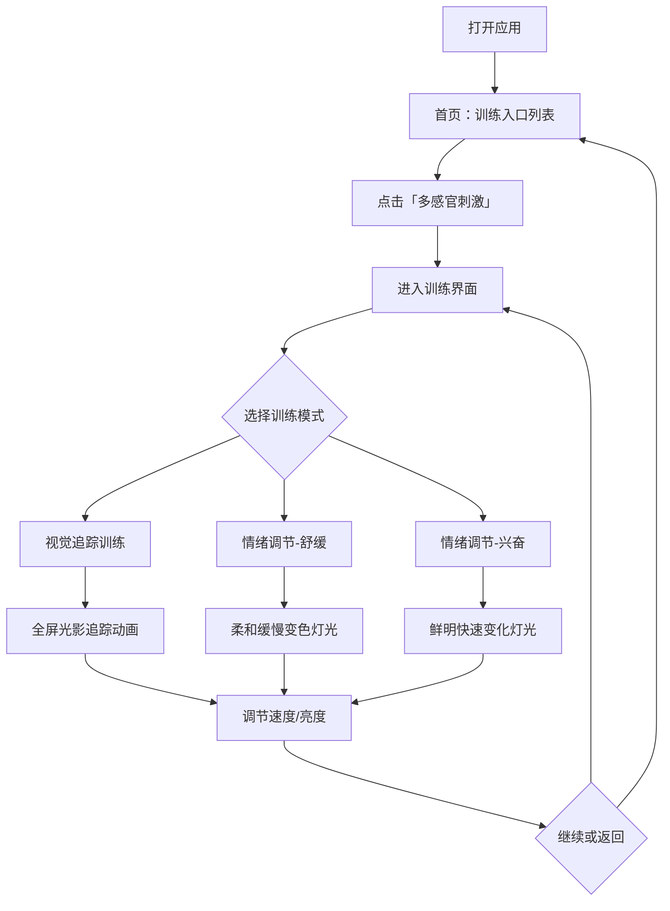

## 1. 产品概述

HYMS（康复视神经训练系统）是一款面向脑梗患者的视觉康复训练 Web 应用，通过多感官刺激帮助患者锻炼视神经灵活性与专注力，同时具备情绪调节功能。应用设计为大屏优先（支持投屏电视），操作极简，适合老年及康复期患者使用。

- 核心目标：通过视觉追踪训练和情绪调节灯光，有效锻炼脑梗患者的视神经灵活性和专注力，防止感官退化
- 目标用户：脑梗康复期患者及其照护人员

## 2. 核心功能

### 2.1 用户角色

| 角色 | 使用方式 | 核心权限 |
|------|----------|----------|
| 患者 | 直接使用 | 观看和体验训练内容 |
| 照护者 | 辅助操作 | 选择训练模式、调节参数 |

### 2.2 功能模块

1. **首页（训练入口）**：展示所有训练模式入口卡片，首个入口为"多感官刺激"
2. **多感官刺激页**：视觉追踪训练 + 情绪调节灯光

### 2.3 页面详情

| 页面名称 | 模块名称 | 功能描述 |
|----------|----------|----------|
| 首页 | 入口导航 | 展示训练模式卡片列表，点击进入对应训练；大字体、高对比度、极简操作 |
| 首页 | 顶部标题区 | 应用名称"康复视神经训练"，简洁品牌标识 |
| 多感官刺激 | 视觉追踪训练 | 全屏轮播色彩与光影动画，移动的光点/光带吸引目光追随，锻炼视神经灵活性 |
| 多感官刺激 | 情绪调节-舒缓模式 | 柔和缓慢变色的灯光效果，舒缓紧张情绪，帮助放松 |
| 多感官刺激 | 情绪调节-兴奋模式 | 色彩鲜明的快速变化灯光，兴奋神经，改善"没精神"状态 |
| 多感官刺激 | 模式切换控制 | 底部控制栏，可切换"追踪训练/舒缓/兴奋"三种模式，调节速度和亮度 |
| 多感官刺激 | 返回首页 | 左上角返回按钮，方便照护者切换 |

## 3. 核心流程

用户打开应用 → 首页展示训练入口 → 点击"多感官刺激" → 进入全屏训练界面 → 选择模式（追踪/舒缓/兴奋）→ 开始训练 → 可调节速度和亮度 → 点击返回回到首页

## 4. 用户界面设计

### 4.1 设计风格

- **主色调**：深色背景（#0a0a1a）配合高饱和度霓虹色彩（青色 #00e5ff、品红 #ff00e5、金色 #ffd700），营造沉浸式感官体验
- **辅助色**：柔和渐变色（薰衣草紫 → 玫瑰粉 → 天空蓝），用于舒缓模式
- **按钮风格**：圆角大按钮，半透明玻璃拟态效果，高对比度文字
- **字体**：使用 Noto Sans SC（思源黑体），标题 48px+，正文 24px+，确保大屏可读性
- **布局风格**：全屏沉浸式，卡片式入口，底部控制栏
- **图标风格**：线性图标，2px 描边，发光效果
- **动画**：CSS + Canvas 混合实现，流畅 60fps，避免闪烁和急速切换（防止不适）

### 4.2 页面设计概览

| 页面名称 | 模块名称 | UI 元素 |
|----------|----------|---------|
| 首页 | 顶部标题区 | 深色渐变背景，大标题"康复视神经训练"，发光文字效果 |
| 首页 | 入口卡片列表 | 玻璃拟态卡片，图标+标题+简述，hover 发光效果，2列网格布局 |
| 多感官刺激 | 全屏画布 | Canvas 全屏渲染，深色背景上的光影动画 |
| 多感官刺激 | 追踪训练模式 | 移动的彩色光球/光带，带拖尾效果，缓慢平滑移动路径 |
| 多感官刺激 | 舒缓模式 | 全屏渐变色缓慢过渡，呼吸般的明暗变化，水波纹效果 |
| 多感官刺激 | 兴奋模式 | 快速变换的高饱和色块，脉冲式闪烁，几何图形旋转 |
| 多感官刺激 | 底部控制栏 | 半透明毛玻璃栏，模式切换按钮组，速度滑块，亮度滑块，返回按钮 |

### 4.3 响应式设计

- **大屏优先**：设计以 1920×1080（电视）为基准
- **桌面适配**：Mac/PC 浏览器 1280×720+ 完美适配
- **触控优化**：所有交互元素最小 48px 点击区域，支持遥控器/鼠标操作
- **全屏模式**：训练界面支持浏览器全屏 API，投屏时一键全屏

### 4.4 无障碍设计

- 高对比度色彩方案，确保视觉障碍患者可辨识
- 动画速度可调节，避免过快闪烁引发不适
- 大字体、大按钮，操作门槛极低
- 提供暂停功能，随时可停止训练
