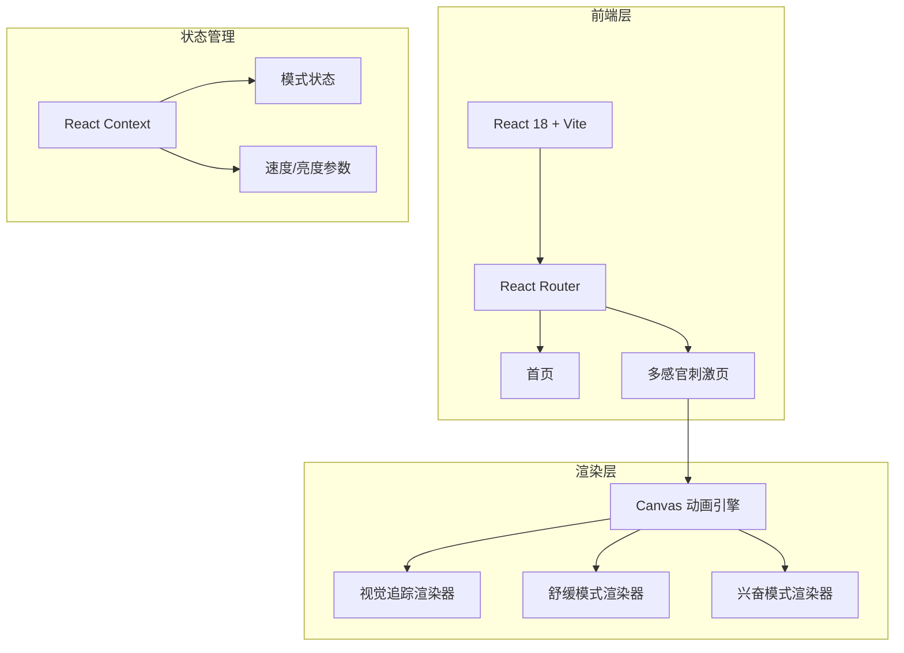

## 1. 架构设计



纯前端架构，无需后端服务。所有动画和逻辑在浏览器端完成，适合投屏到电视使用。

## 2. 技术说明

- **前端框架**：React 18 + TypeScript
- **构建工具**：Vite
- **样式方案**：Tailwind CSS 3
- **动画渲染**：HTML5 Canvas 2D（requestAnimationFrame 驱动）
- **路由**：React Router v6
- **后端**：无（纯前端应用）
- **数据库**：无（本地状态管理，无需持久化）

## 3. 路由定义

| 路由 | 用途 |
|------|------|
| `/` | 首页，展示训练模式入口列表 |
| `/sensory` | 多感官刺激训练页，全屏动画+控制栏 |

## 4. 项目结构

```
trae-hyms/
├── src/
│   ├── components/
│   │   ├── Layout.tsx              # 全局布局
│   │   ├── TrainingCard.tsx        # 训练入口卡片
│   │   └── ControlBar.tsx          # 底部控制栏
│   ├── pages/
│   │   ├── Home.tsx                # 首页
│   │   └── SensoryTraining.tsx     # 多感官刺激页
│   ├── renderers/
│   │   ├── TrackingRenderer.ts     # 视觉追踪渲染器
│   │   ├── CalmRenderer.ts         # 舒缓模式渲染器
│   │   └── ExciteRenderer.ts       # 兴奋模式渲染器
│   ├── context/
│   │   └── TrainingContext.tsx      # 训练状态管理
│   ├── hooks/
│   │   └── useCanvas.ts            # Canvas 动画 Hook
│   ├── App.tsx
│   ├── main.tsx
│   └── index.css
├── index.html
├── package.json
├── tsconfig.json
├── tailwind.config.js
├── vite.config.ts
└── postcss.config.js
```

## 5. 核心渲染器设计

### 5.1 视觉追踪渲染器（TrackingRenderer）

- 在 Canvas 上绘制 3-5 个彩色光球
- 光球沿贝塞尔曲线缓慢移动，带发光拖尾效果
- 颜色在青色、品红、金色之间渐变
- 速度可调（0.5x - 2x）

### 5.2 舒缓模式渲染器（CalmRenderer）

- 全屏渐变色缓慢过渡（薰衣草紫 → 玫瑰粉 → 天空蓝 → 薄荷绿）
- 呼吸般的明暗脉动（4-6秒一个周期）
- 柔和的水波纹扩散效果
- 速度可调（0.5x - 2x）

### 5.3 兴奋模式渲染器（ExciteRenderer）

- 高饱和度色块快速变换
- 脉冲式闪烁节奏（1-2秒一个周期）
- 几何图形（三角形、圆形、菱形）旋转和缩放
- 速度可调（0.5x - 2x）

## 6. 性能要求

- Canvas 动画保持 60fps
- 使用 requestAnimationFrame 而非 setInterval
- 光球数量和粒子密度根据设备性能自适应
- 支持浏览器全屏 API（Fullscreen API）
